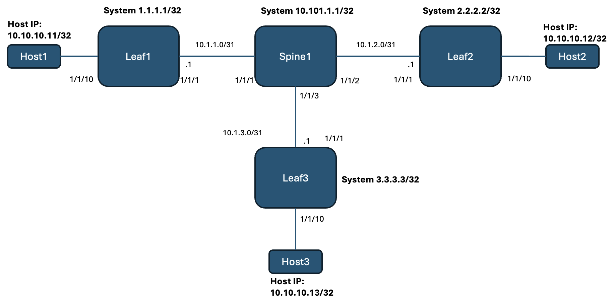
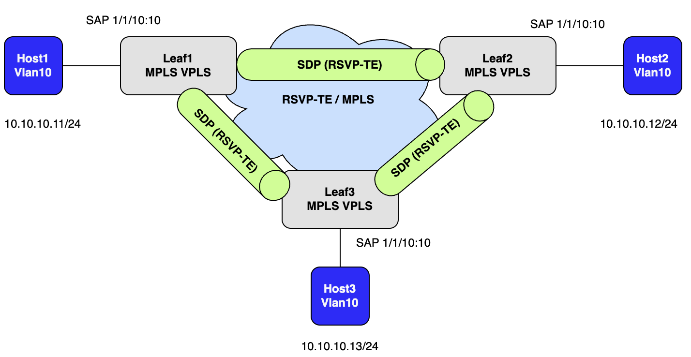
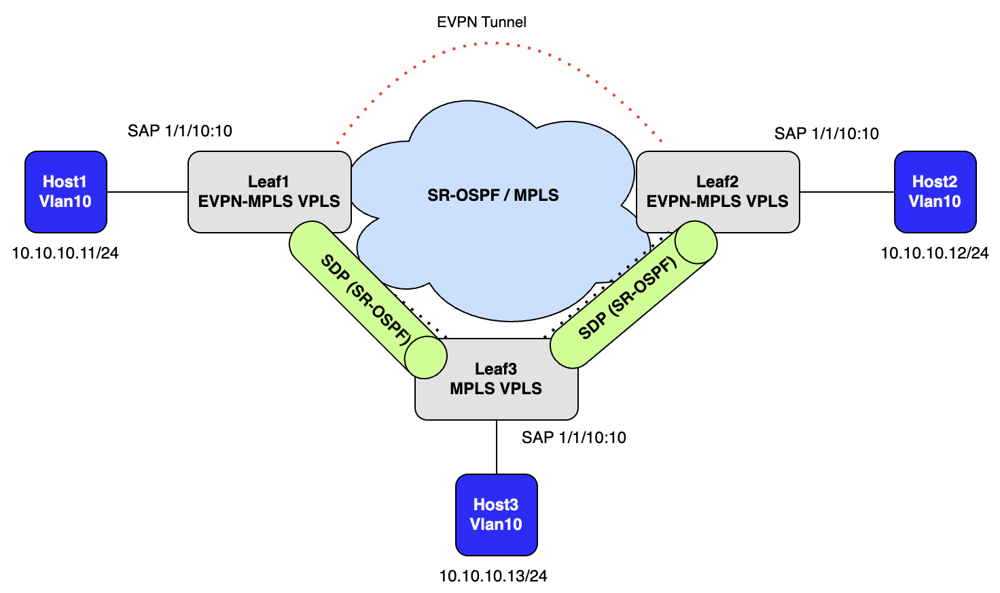

# SR OS EVPN-MPLS Configuration Reference Guide

This page provides the basic step-by-step configuration required to migrate from RSVP-TE MPLS based VPLS services to EVPN-MPLS, using Segment Routing as the underlay infrastructure.  

| Contributors | Handle |
|---|---|
| Cory Morris | [comorris](https://github.com/comorris) |


All configurations are in MD-CLI flat format. Reference chassis is the ixr-s and software version is SR OS 24.10.R3. Use `show system info` command to verify your router's chassis model and software version.

The following services are covered in this guide:


- [VPLS](#VPLS)
- [EVPN-MPLS](#EVPN-MPLS-with-SR-OSPF-Underlay)

A list of [show commands](#show-commands) is also provided in this guide.

# Topology, IPv4 Addressing and Description

We will be using the below topology with 3 routers, 1 spine router and 3 linux hosts, each connected to 1 leaf.

Each router will have a base configuration with OSPF underlay, RSVP-TE and VPLS already configured.  Configuration examples for converting to EVPN-MPLS with Segment Routing using OSFP (SRO-OSPF) will be shown below.  Only the VPLS services on Leaf1 and Leaf2 will be converted to VPLS over EVPN-MPLS, while leaf 3 will remain as VPLS over MPLS to show interworking.  The majority of the configuration will be done on Leaf1 and Leaf2.  

In the final step, we will configure Leaf3 to utilize SR-OSPF for it's MPLS tunnels to fully convert the network to SR-OSPF while still operating in VPLS over MPLS mode.

The physical topology is shown below



## Initial Logical Topology for VPLS over MPLS


## Endig Logical Toployg for VPLS over EVPN-MPLS w/SR-OSPF

The goal of this lab is end up with a fully functioning EVPN-MPLS network using SR-OSPF for the MPLS transport



# vSIM image

The containerlab topology uses a vSIM image that is containerized using the vrnetlab project. Follow the instructions on the [Nokia SR OS (vSIM)](https://containerlab.dev/manual/kinds/vr-sros/) page to create and load the image intto your docker environment.
Contact your Account team to obtain a vSIM license.

# Deploying the lab

Clone this repo to your local environment:

```
git clone https://github.com/comorris/sros-evpn-mpls.git
```

Navigate to the directory for this lab:

```
cd evpn-mpls
```

Ensure vSIM license is copied.

Modify the Topology file:

First modify the topology file to give it a unique name.  Since multiple copies of this lab will be hosted on the same host machine, each topologyanem must be unique, otherwise we will run into conflicts.

Change the 'name' field from evpn-mpls to evpn-mpls-pod1 for example using your preferred text editor (vi, nano, etc..)

Deploy the lab:
```
clab deploy --topo evpn-mpls.clab.yml
```

At the end of the deployment process, the following table will be displayed:

```
╭──────┬────────────────────────────────────┬─────────┬────────────────────╮
│ Name │             Kind/Image             │  State  │   IPv4/6 Address   │
├──────┼────────────────────────────────────┼─────────┼────────────────────┤
│ cea  │ linux                              │ running │ 172.10.10.10       │
│      │ ghcr.io/srl-labs/network-multitool │         │ 2001:172:10:10::10 │
├──────┼────────────────────────────────────┼─────────┼────────────────────┤
│ ceb  │ linux                              │ running │ 172.10.10.11       │
│      │ ghcr.io/srl-labs/network-multitool │         │ 2001:172:10:10::11 │
├──────┼────────────────────────────────────┼─────────┼────────────────────┤
│ cey  │ linux                              │ running │ 172.10.10.13       │
│      │ ghcr.io/srl-labs/network-multitool │         │ 2001:172:10:10::13 │
├──────┼────────────────────────────────────┼─────────┼────────────────────┤
│ cez  │ linux                              │ running │ 172.10.10.12       │
│      │ ghcr.io/srl-labs/network-multitool │         │ 2001:172:10:10::12 │
├──────┼────────────────────────────────────┼─────────┼────────────────────┤
│ p1   │ nokia_srsim                        │ running │ 172.10.10.6        │
│      │ localhost/nokia/srsim:25.7.R1      │         │ 2001:172:10:10::6  │
├──────┼────────────────────────────────────┼─────────┼────────────────────┤
│ p2   │ nokia_srsim                        │ running │ 172.10.10.7        │
│      │ localhost/nokia/srsim:25.7.R1      │         │ 2001:172:10:10::7  │
├──────┼────────────────────────────────────┼─────────┼────────────────────┤
│ pe1  │ nokia_srsim                        │ running │ 172.10.10.2        │
│      │ localhost/nokia/srsim:25.7.R1      │         │ 2001:172:10:10::2  │
├──────┼────────────────────────────────────┼─────────┼────────────────────┤
│ pe2  │ nokia_srsim                        │ running │ 172.10.10.3        │
│      │ localhost/nokia/srsim:25.7.R1      │         │ 2001:172:10:10::3  │
├──────┼────────────────────────────────────┼─────────┼────────────────────┤
│ pe3  │ nokia_srsim                        │ running │ 172.10.10.4        │
│      │ localhost/nokia/srsim:25.7.R1      │         │ 2001:172:10:10::4  │
├──────┼────────────────────────────────────┼─────────┼────────────────────┤
│ pe4  │ nokia_srsim                        │ running │ 172.10.10.5        │
│      │ localhost/nokia/srsim:25.7.R1      │         │ 2001:172:10:10::5  │
╰──────┴────────────────────────────────────┴─────────┴────────────────────╯
```

# SR-MPLS Underlay

## Segment Routing Lable Range

In this example, we will configure the Segment Routing label ranges that each router will use to assign segment routing prefix SIDs.  This label range will be same on each router in the topology as part of the Segment Routing Global Block (SRGB).  Here we configure a static range as well so that the default ranges do not overlap with the configured SRGB. 
```
/configure router "Base" mpls-labels static-label-range 11968
/configure router "Base" mpls-labels sr-labels start 12000
/configure router "Base" mpls-labels sr-labels end 19999
```
## Segment Routing over OSPF - SR-OSPF

In this example we enable Segment Routing under the OSPF routing context.  The node SID index should be unique per node.  Leaf1 for example will use node-sid index 1, leaf2 will use node-side index 2, and so on.  See below:
Leaf1: 1
Leaf2: 2
Leaf3: 3
Spine1: 101

Leaf1 Example:
```
/configure router "Base" ospf 0 advertise-router-capability area
/configure router "Base" ospf 0 segment-routing admin-state enable
/configure router "Base" ospf 0 segment-routing prefix-sid-range global
/configure router "Base" ospf 0 area 0.0.0.0 interface "system" node-sid index 1
```

### Show commands for validation of SR SID propogation and SR tunnels

```
show router ospf opaque-database
```

#### Opaque Database LSA Types
Type 1 = Traffic Engineering
Type 4 = Router Information LSA
Type 7 = Extended Prefix LSA
Type 8 = Extended Link LSA

```
show router ospf opaque-database adv-router x.x.x.x ls-id x detail 
```

Display the router tunnel table to show both SR and RSVP tunnels
```
 show router tunnel-table 
```

This tools command will provide absolute label id for each tunnel
```
tools dump router segment-routing tunnel
```

# EVPN-MPLS

## BGP

Configure BGP to exchange EVPN routes.  We will setup a iBGP peering session between all Leaf1 and Leaf2 only because as mentioned in the toplogy session, only Leaf1 and Leaf2 will be configured with over VPLS over EVPN-MPLS.

Leaf1 example peering to the system IP of Leaf2
```
/configure router autonomous-system 65001
/configure router "Base" bgp min-route-advertisement 1
/configure router "Base" bgp vpn-apply-export true
/configure router "Base" bgp vpn-apply-import true
/configure router "Base" bgp rapid-withdrawal true
/configure router "Base" bgp peer-ip-tracking true
/configure router "Base" bgp rapid-update vpn-ipv4 true
/configure router "Base" bgp rapid-update evpn true
/configure router "Base" bgp group "evpn" type internal
/configure router "Base" bgp group "evpn" family evpn true
/configure router "Base" bgp neighbor "2.2.2.2" group "evpn"
```

## Migrate to spoke-sdp
On Leaf1 and Leaf2 migrate to spoke SDP in order to add the EVPN configuration.  We will also create a Split Horizon group which we will add both the spokes and EVPN tunnels to.

Example on Leaf1
```
/configure service vpls "vlan10" delete mesh-sdp 1:10 
/configure service vpls "vlan10" delete mesh-sdp 3:10 
/configure service vpls "vlan10" spoke-sdp 1:10 admin-state enable
/configure service vpls "vlan10" spoke-sdp 3:10 admin-state enable
/configure service { vpls "vlan10" split-horizon-group "shg-10" }
/configure service vpls "vlan10" spoke-sdp 1:10 split-horizon-group "shg-10"
/configure service vpls "vlan10" spoke-sdp 3:10 split-horizon-group "shg-10"
```

## EVPN
In this section will add add the necessary bgp-evpn configuration options
Example on Leaf1
```
/configure service vpls "vlan10" proxy-arp admin-state enable
/configure service vpls "vlan10" proxy-arp dynamic-populate true
/configure service vpls "vlan10" bgp 1 route-distinguisher "2.2.2.2:10"
/configure service vpls "vlan10" bgp 1 route-target export "target:65001:10"
/configure service vpls "vlan10" bgp 1 route-target import "target:65001:10"
/configure service vpls "vlan10" bgp-evpn evi 10
/configure service vpls "vlan10" bgp-evpn mpls 1 admin-state enable
/configure service vpls "vlan10" bgp-evpn mpls 1 split-horizon-group "shg-10"
/configure service vpls "vlan10" bgp-evpn mpls 1 ecmp 2
/configure service vpls "vlan10" bgp-evpn mpls 1 auto-bind-tunnel resolution any
```


### show commands

EVPN Route verification 
```
show router bgp neighbor "<neighbor-ip>" advertised-routes evpn incl-mcast 
show router bgp neighbor "<neighbor-ip>" advertised-routes evpn mac 
show router bgp neighbor "<neighbor-ip>" received-routes evpn 
show router bgp neighbor "<neighbor-ip>" advertised-routes evpn 
```

Verify proxy arp
```
show service id 10 proxy-arp detail 
```

With the completion of this section you should see EVPN routes exchanged between Leaf1 and Leaf2, however the remote MACs will still be preferred over the existing spoke SDPs.  
Let's change that by migrating the VPLS services over to SR-OSPF.

# SR-MPLS Migration

Here we will showcase two different options for migrating to SR-OSPF.

## Option 1: Change tunnel preference on a per service basis
This will only affect specific services that we configure to prefer SR-OSPF over RSVP-TE.

Enter the following command on both Leaf1 and Leaf2
```
/configure service vpls "vlan10" bgp-evpn mpls 1 auto-bind-tunnel resolution-filter sr-ospf true
```

Verify where the remote MACs are learned from in the FDB table
```
show service id 10 fdb detail 
```

Once we have verified that our tunnels work over SR-OSPF lets revert back to resolution 'any' to demonstrate the second option.
```
/configure service vpls "vlan10" bgp-evpn mpls 1 auto-bind-tunnel resolution-filter delete rsvp
/configure service vpls "vlan10" bgp-evpn mpls 1 auto-bind-tunnel resolution any 
```

## Option 2: Change tunnel preference system wide
Now that we have confirmed sr-ospf is working, let's make a system wide change and convert all 3 leaf routers to use SR-OSPF.  **RSVP is given a higher preference value so that OSPF is preferred in our topology.**

Here we will raise the tunnel table preference for RSVP.  Now SR-OSPF, when avaiable, will be the preferred tunnel for all services.
```
/configure router "Base" mpls tunnel-table-pref rsvp-te 15
```

Verify the FDB table.  Leaf1 and Leaf2 should now learn the remote MACs from each other over EVPN-MPLS.
```
show service id 10 fdb detail 
```

### Convert to SR-OSPF

Here, we will convert all spoke SDPs connected to Leaf3 to SR-OSPF and remove the spoke SDPs between Leaf1 and Leaf2, as EVPN-MPLS is now preferred.

Example on Leaf1
```
/configure service vpls "vlan10" delete spoke-sdp 2:10 
/configure service delete sdp 2
/configure service sdp 3 delete lsp "to-Leaf3" 
/configure service sdp 3 sr-ospf true 
```

Example on Leaf1
```
/configure service vpls "vlan10" delete spoke-sdp 1:10 
/configure service delete sdp 1
/configure service sdp 3 delete lsp "to-Leaf3" 
/configure service sdp 3 sr-ospf true 
```

Example on Leaf3
```
/configure service sdp 1 delete lsp "to-Leaf1" 
/configure service sdp 1 sr-ospf true
/configure service sdp 2 delete lsp "to-Leaf2" 
/configure service sdp 2 sr-ospf true
```

Verify SR-OSFP is enabled on the SDP
```
show service  sdp 1 detail 
 
 ------------------------------SNIP--------------------------------------------
-------------------------------------------------------------------------------
Segment Routing
-------------------------------------------------------------------------------
ISIS                 : disabled              
OSPF                 : enabled               LSP Id             : 524290
Oper Instance Id     : 0                     
TE-LSP               : disabled              
===============================================================================
```

RSVP is no longer preferred.

Now let's take a big leap and remove mpls and rsvp completely from all routers!!

Run the below commands on Leaf1, Leaf2, Leaf3 and Spine1
```
/configure router delete rsvp 
/configure router delete mpls
```

Verify that SR-OSPF tunnels are used int the tunnel table
```
show router tunnel-table 
```

Verify all MACs are still in the fdb table 
```
show service id 10 fdb detail 
```

Congratulations, you have fully migrated a network from RSVP to SR-OSPF